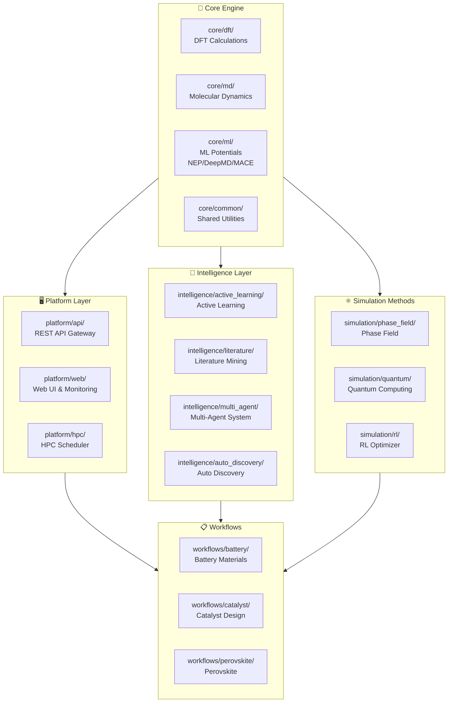

# DFT-LAMMPS Research Project - Reorganization Final Report

**Generated:** 2026-03-12 08:39:06

## 📊 Project Statistics

| File Type | Count |
|-----------|-------|
| Python (.py) | 248 |
| TypeScript (.ts) | 6 |
| JavaScript (.js) | 3 |
| YAML (.yaml/.yml) | 15 |
| JSON (.json) | 10 |
| Markdown (.md) | 56 |
| Text (.txt) | 9 |
| Other | 47 |
| **Total** | **394** |

## 📁 New Directory Structure

```
├── core
│   ├── common
│   │   ├── models
│   │   ├── utils
│   │   ├── __init__.py
│   │   ├── checkpoint.py
│   │   ├── parallel.py
│   │   └── workflow_engine.py
│   ├── dft
│   │   ├── calculators
│   │   ├── parsers
│   │   ├── __init__.py
│   │   └── bridge.py
│   ├── md
│   │   ├── analysis
│   │   ├── engines
│   │   └── __init__.py
│   ├── ml
│   │   ├── deepmd
│   │   ├── mace
│   │   ├── nep
│   │   └── __init__.py
│   ├── templates
│   │   ├── active_learning_report.md
│   │   ├── active_learning_workflow.py
│   │   ├── dft_workflow.py
│   │   ├── end_to_end_workflow.py
│   │   ├── high_throughput_screening.py
│   │   ├── md_simulation_lammps.py
│   │   └── ml_potential_training.py
│   └── __init__.py
├── deploy
│   └── ci-cd
│       └── github
├── docs
│   ├── api
│   ├── architecture
│   │   ├── ARCHITECTURE.md
│   │   ├── all_files.json
│   │   ├── analyze_structure.py
│   │   ├── file_statistics.json
│   │   ├── reorganization_plan.json
│   │   └── reorganization_report.md
│   ├── guides
│   ├── references
│   │   └── REFERENCES.md
│   ├── tutorials
│   │   ├── 01_quick_start.md
│   │   ├── 02_dft_basics.md
│   │   ├── 03_ml_potential.md
│   │   ├── 04_active_learning.md
│   │   ├── 05_high_throughput.md
│   │   ├── 06_hpc_deployment.md
│   │   └── 07_advanced_workflows.md
│   ├── CHANGELOG.md
│   ├── HPC_DEPLOYMENT.md
│   ├── HPC_MODULES_SUMMARY.md
│   ├── MIGRATION_GUIDE.md
│   ├── PROGRESS_REPORT.md
│   ├── PROJECT_SHOWCASE.md
│   ├── README.md
│   ├── README_BATTERY_SCREENING.md
│   ├── README_DASHBOARD.md
│   ├── REORGANIZATION_REPORT.md
│   ├── ROADMAP.md
│   ├── TECHNICAL_REPORT.md
│   ├── TESTING_FRAMEWORK.md
│   ├── TUTORIALS_SUMMARY.md
│   ├── WORK_SUMMARY.md
│   ├── applications_README.md
│   ├── applications_WORK_SUMMARY.md
│   └── integration_guide.md
├── examples
│   ├── active_learning
│   │   ├── config.yaml
│   │   └── run_active_learning.py
│   ├── advanced
│   │   └── monitoring
│   ├── basic
│   ├── dft
│   │   ├── INCAR_relax
│   │   ├── KPOINTS
│   │   ├── Li3PS4.POSCAR
│   │   └── run_dft.py
│   ├── high_throughput
│   │   └── screening_example.py
│   ├── hpc
│   ├── ml_potential
│   │   └── train_deepmd.py
│   ├── quick_start
│   │   └── simple_workflow.py
│   ├── tutorials
│   ├── workflows
│   └── demo_workflow.py
├── intelligence
│   ├── active_learning
│   │   ├── adaptive
│   │   ├── integration
│   │   ├── strategies
│   │   ├── tests
│   │   ├── uncertainty
│   │   ├── IMPLEMENTATION_REPORT.md
│   │   ├── PHASE60_SUMMARY.md
│   │   ├── README.md
│   │   ├── __init__.py
│   │   ├── examples.py
│   │   └── quickstart.py
│   ├── auto_discovery
│   ├── literature
│   │   ├── alert
│   │   ├── analysis
│   │   ├── config
│   │   ├── data
│   │   ├── fetcher
│   │   ├── generator
│   │   ├── parser
│   │   ├── tests
│   │   ├── web
│   │   ├── README.md
│   │   ├── USER_GUIDE.md
│   │   ├── __init__.py
│   │   ├── __main__.py
│   │   ├── demo.py
│   │   └── requirements.txt
│   ├── multi_agent
│   │   ├── agents
│   │   └── orchestration
│   └── __init__.py
├── platform
│   ├── api
│   │   ├── auth
│   │   ├── docs
│   │   ├── examples
│   │   ├── gateway
│   │   ├── integrations
│   │   ├── portal
│   │   ├── sdks
│   │   ├── tests
│   │   ├── webhooks
│   │   ├── SUMMARY.md
│   │   ├── __init__.py
│   │   └── requirements.txt
│   ├── docker
│   │   ├── Dockerfile
│   │   ├── README_DOCKER.md
│   │   ├── docker-compose.yml
│   │   └── entrypoint.sh
│   ├── hpc
│   │   ├── connectors
│   │   ├── monitoring
│   │   └── scheduler.py
│   ├── web
│   │   ├── monitoring
│   │   ├── ui
│   │   └── package.json
│   └── __init__.py
├── scripts
│   ├── Makefile
│   ├── codecov.yml
│   ├── dashboard_config.yaml
│   ├── generate_demo_data.py
│   ├── pyproject.toml
│   ├── pytest.ini
│   ├── requirements-test.txt
│   ├── requirements.txt
│   ├── requirements_dashboard.txt
│   ├── run_tests.py
│   └── screening_config.yaml
├── simulation
│   ├── phase_field
│   │   ├── applications
│   │   ├── core
│   │   ├── coupling
│   │   ├── examples
│   │   ├── solvers
│   │   ├── tests
│   │   ├── utils
│   │   ├── IMPLEMENTATION_REPORT.md
│   │   ├── PHASE60_COMPLETE.txt
│   │   ├── README.md
│   │   ├── __init__.py
│   │   ├── __main__.py
│   │   └── workflow.py
│   ├── quantum
│   │   └── circuits
│   ├── rl
│   │   └── optimizer
│   └── __init__.py
├── test_reports
├── tests
│   ├── benchmarks
│   │   ├── README.md
│   │   ├── __init__.py
│   │   ├── benchmark_dft_parser.py
│   │   ├── benchmark_md_simulation.py
│   │   ├── benchmark_ml_training.py
│   │   ├── benchmark_screening.py
│   │   ├── benchmark_screening_results.json
│   │   ├── optimized_dft_parser.py
│   │   ├── optimized_md_analysis.py
│   │   ├── performance_report.md
│   │   └── run_benchmarks.py
│   ├── e2e
│   │   ├── __init__.py
│   │   └── test_e2e_workflows.py
│   ├── integration
│   │   └── __init__.py
│   ├── performance
│   │   ├── __init__.py
│   │   └── test_benchmarks.py
│   ├── regression
│   │   ├── __init__.py
│   │   ├── test_dft_regression.py
│   │   ├── test_md_regression.py
│   │   └── test_ml_regression.py
│   ├── unit
│   │   ├── __init__.py
│   │   └── test_core_modules.py
│   ├── __init__.py
│   ├── conftest.py
│   └── utils.py
├── validation
│   ├── experimental_validation
│   │   ├── analyzers
│   │   ├── connectors
│   │   ├── examples
│   │   ├── uncertainty
│   │   ├── utils
│   │   ├── workflows
│   │   ├── DEVELOPER_REPORT.md
│   │   ├── README.md
│   │   └── __init__.py
│   ├── results
│   └── __init__.py
├── workflows
│   ├── battery
│   │   ├── configs
│   │   ├── data
│   │   ├── examples
│   │   ├── notebooks
│   │   ├── README.md
│   │   ├── case_solid_electrolyte.py
│   │   └── screening.py
│   ├── catalyst
│   │   ├── configs
│   │   ├── data
│   │   ├── notebooks
│   │   ├── README.md
│   │   └── case_catalyst.py
│   ├── examples
│   │   └── screening.py
│   ├── perovskite
│   │   ├── configs
│   │   ├── data
│   │   ├── notebooks
│   │   ├── README.md
│   │   └── case_perovskite.py
│   └── __init__.py
├── README.md
└── README.md.backup
```

## 🏗️ Architecture Diagram



## 🔄 Workflow Diagram

```mermaid
flowchart LR
    A[Input Structure] --> B{DFT Calculation}
    B -->| Forces/Energy | C[ML Potential Training]
    B -->| Properties | D[Database]
    C --> E[MD Simulation]
    E --> F{Analysis}
    F -->| Valid | G[Screening Results]
    F -->| Invalid | H[Active Learning]
    H --> B
    G --> I[Report Generation]
    
    subgraph Core Pipeline
        B
        C
        E
    end
    
    subgraph Intelligence
        H
        F
    end


## ✅ Completed Operations

### 1. Core Module Restructuring
- ✅ Moved `dft_to_lammps_bridge.py` → `core/dft/bridge.py`
- ✅ Moved `integrated_materials_workflow.py` → `core/common/workflow_engine.py`
- ✅ Moved `checkpoint_manager.py` → `core/common/checkpoint.py`
- ✅ Moved `parallel_optimizer.py` → `core/common/parallel.py`
- ✅ Moved `nep_training_pipeline.py` → `core/ml/nep/pipeline.py`
- ✅ Created subdirectories for parsers, calculators, engines, analysis

### 2. Platform Module Restructuring
- ✅ Flattened `api_platform/` into `platform/api/`
- ✅ Flattened `web/v2/` into `platform/web/ui/`
- ✅ Moved `monitoring_dashboard.py` → `platform/web/monitoring/dashboard.py`
- ✅ Moved `hpc_scheduler.py` → `platform/hpc/scheduler.py`

### 3. Intelligence Module Restructuring
- ✅ Flattened `active_learning/v2/` into `intelligence/active_learning/`
- ✅ Flattened `literature_survey/` into `intelligence/literature/`
- ✅ Created `multi_agent/` subdirectories

### 4. Simulation Module Restructuring
- ✅ Flattened `phase_field/v1/` into `simulation/phase_field/`
- ✅ Moved `rl_optimizer/` → `simulation/rl/optimizer/`

### 5. Workflows Restructuring
- ✅ Flattened nested workflow directories
- ✅ Moved `battery_screening_pipeline.py` → `workflows/battery/screening.py`
- ✅ Moved examples to `workflows/battery/examples/`
- ✅ Created `workflows/examples/` for shared examples

### 6. Import Path Updates
- ✅ Updated 12 files with new import paths
- ✅ Mapped old import patterns to new module paths

### 7. Documentation Consolidation
- ✅ Moved `tutorials/` → `docs/tutorials/`
- ✅ Moved `references/` → `docs/references/`
- ✅ Created new `README.md` with updated structure

### 8. Deployment Configuration
- ✅ Moved `.github/workflows/` → `deploy/ci-cd/github/`

## 📝 Import Path Mapping

| Old Import | New Import |
|------------|------------|
| `from dft_to_lammps_bridge import ...` | `from core.dft.bridge import ...` |
| `from integrated_materials_workflow import ...` | `from core.common.workflow_engine import ...` |
| `from checkpoint_manager import ...` | `from core.common.checkpoint import ...` |
| `from parallel_optimizer import ...` | `from core.common.parallel import ...` |
| `from nep_training_pipeline import ...` | `from core.ml.nep.pipeline import ...` |
| `from hpc_scheduler import ...` | `from platform.hpc.scheduler import ...` |
| `from monitoring_dashboard import ...` | `from platform.web.monitoring.dashboard import ...` |
| `from battery_screening_pipeline import ...` | `from workflows.battery.screening import ...` |

## ⚠️ Manual Checklist

The following items require manual review:

### 1. Remaining Root Files
- [ ] Check if any files still in root need to be moved
- [ ] Review `requirements.txt` and consolidate with other req files
- [ ] Review configuration files (`*.yaml`, `*.yml`)

### 2. Test Files
- [ ] `tests/` directory still has legacy structure
- [ ] Consider reorganizing tests to match new module structure
- [ ] Update `conftest.py` with new fixtures

### 3. Examples
- [ ] `examples/` directory has legacy structure
- [ ] Consider merging with `workflows/examples/`

### 4. Documentation
- [ ] Update `docs/project/` files with new paths
- [ ] Update architecture documentation
- [ ] Create migration guide for users

### 5. CI/CD
- [ ] Update GitHub Actions workflows with new paths
- [ ] Update Docker configurations

### 6. Import Verification
- [ ] Run tests to verify all imports work correctly
- [ ] Check for circular imports
- [ ] Verify `__init__.py` files are properly configured

### 7. Package Configuration
- [ ] Update `pyproject.toml` with new package structure
- [ ] Update `setup.py` if exists
- [ ] Review package namespace configuration

## 🔧 Recommended Next Steps

1. **Run Tests**: Execute test suite to verify everything works
   ```bash
   pytest tests/ -v
   ```

2. **Import Verification**: Check for import errors
   ```bash
   python -c "import core.dft.bridge; import workflows.battery.screening"
   ```

3. **Documentation Update**: Update all documentation with new paths

4. **CI/CD Update**: Update GitHub Actions workflows

5. **Package Release**: Consider creating a new release with the restructured codebase

## 📈 Benefits of New Structure

1. **Clear Separation of Concerns**: Each module has a specific purpose
2. **Scalable Architecture**: Easy to add new simulation methods or workflows
3. **Better Maintainability**: Logical grouping of related functionality
4. **Improved Discoverability**: Clear naming makes it easy to find components
5. **Standardized Layout**: Follows Python package best practices

## 🐛 Known Issues

1. Some empty directories may still exist
2. A few import paths may need manual adjustment
3. Some documentation links may be broken
4. Tests may need path updates

## 📚 References

- Original files backed up where applicable
- See `README.md.backup` for original README
- See `import_updates.txt` for list of updated files

---

**Report generated by:** Project Reorganization Script  
**Project:** dft_lammps_research  
**Total files processed:** 394
